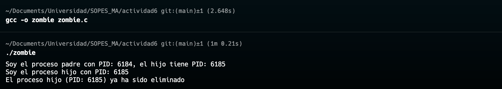
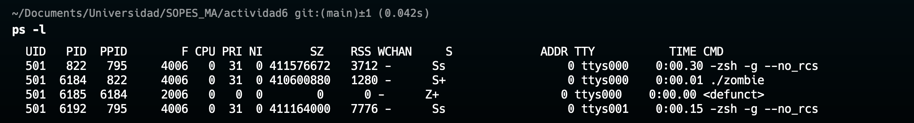

# Actividad 6

## Problema 1
Este programa llama a fork() tres veces, lo que significa que el número total de procesos creados puede calcularse en función del comportamiento de fork() en cada llamada.

Cuando el programa comienza, hay un solo proceso, el proceso original.
- La primera llamada a fork() crea un proceso hijo. Ahora hay 2 procesos en ejecución.
- La segunda llamada a fork() es ejecutada tanto por el proceso padre como por el hijo, lo que significa que crea dos nuevos procesos. Ahora hay 4 procesos en total.
- La tercera llamada a fork() es ejecutada por los 4 procesos existentes, creando otros 4 procesos. Ahora hay 8 procesos en total.

Por lo tanto, el programa genera un total de 8 procesos, incluyendo el proceso original.

## Problema 2
```c
int main() {
    pid_t pid = fork();

    if (pid < 0) {
        perror("fork");
        exit(1);
    }

    if (pid == 0) {
        // Código del proceso hijo
        printf("Soy el proceso hijo con PID: %d\n", getpid());
        // El proceso hijo termina inmediatamente
        exit(0);
    } else {
        // Código del proceso padre
        printf("Soy el proceso padre con PID: %d, el hijo tiene PID: %d\n", getpid(), pid);

        // Espera 60 segundos antes de terminar
        sleep(60);

        // Espera a que el hijo termine, liberando el estado zombie
        wait(NULL);

        printf("El proceso hijo (PID: %d) ya ha sido eliminado\n", pid);
    }

    return 0;
}
```

Compila el programa en Linux


Estado de los procesos



## Problema 3
```c
#include <stdio.h>
#include <stdlib.h>
#include <unistd.h>
#include <pthread.h>

// Función para el hilo
void* thread_function(void* arg) {
    printf("Hilo creado en el proceso con PID: %d\n", getpid());
    return NULL;
}

int main() {
    pid_t pid;
    pthread_t thread;

    pid = fork();
    
    if (pid == 0) {  // Proceso hijo
        printf("Proceso hijo con PID: %d\n", getpid());
        fork();  // El proceso hijo crea otro proceso
        printf("Proceso nieto creado\n");

        // Crea un hilo dentro del proceso hijo
        if (pthread_create(&thread, NULL, thread_function, NULL)) {
            fprintf(stderr, "Error creando el hilo\n");
            return 1;
        }

        // Espera a que termine el hilo
        pthread_join(thread, NULL);
    }

    // Proceso padre y cualquier proceso creado anteriormente ejecutan otro fork()
    fork();  
    printf("Proceso con PID: %d\n", getpid());

    return 0;
}
```

Procesos:
- **Procesos únicos creados**: 6
- **Hilos únicos creados**: 1